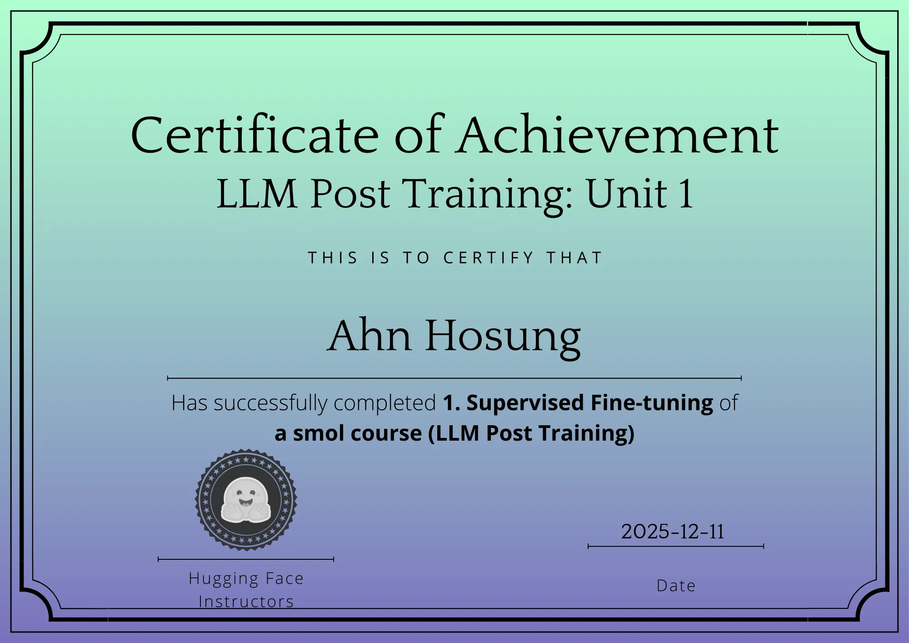
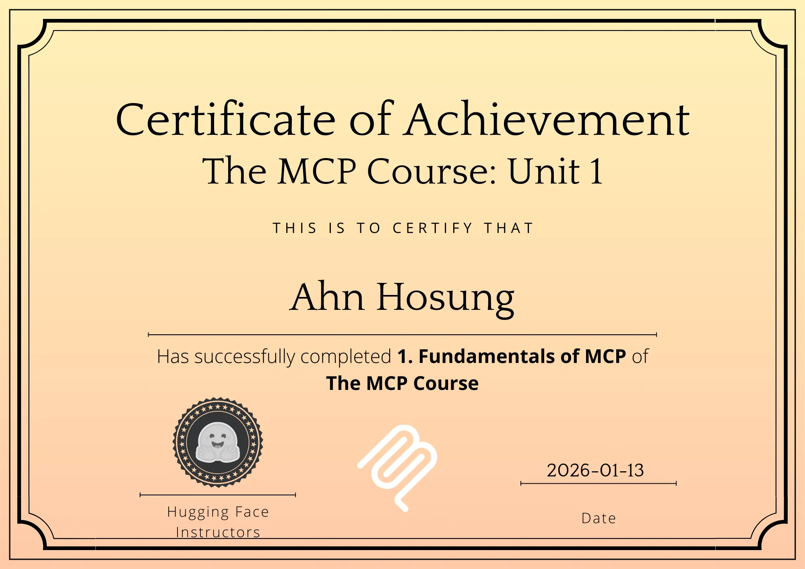
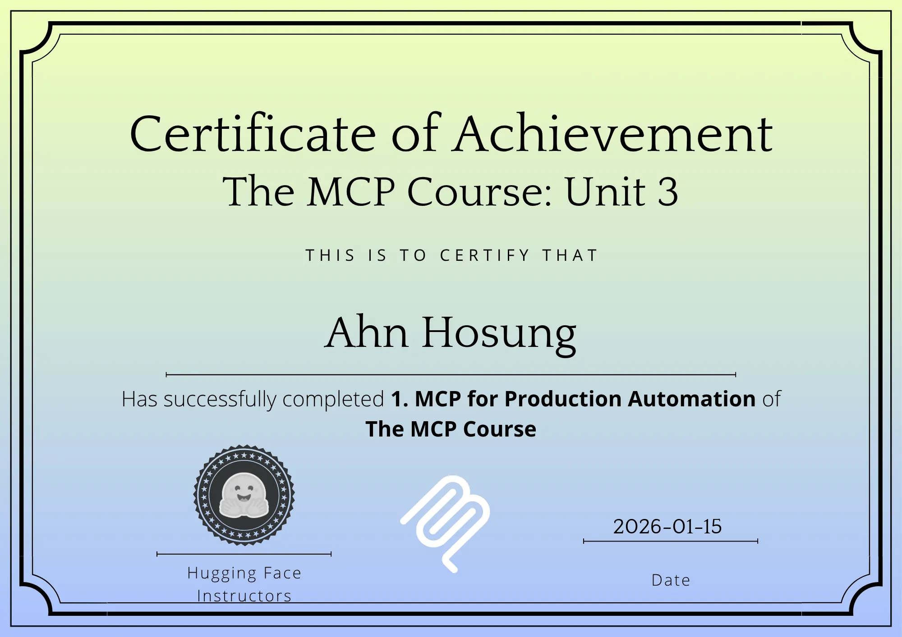
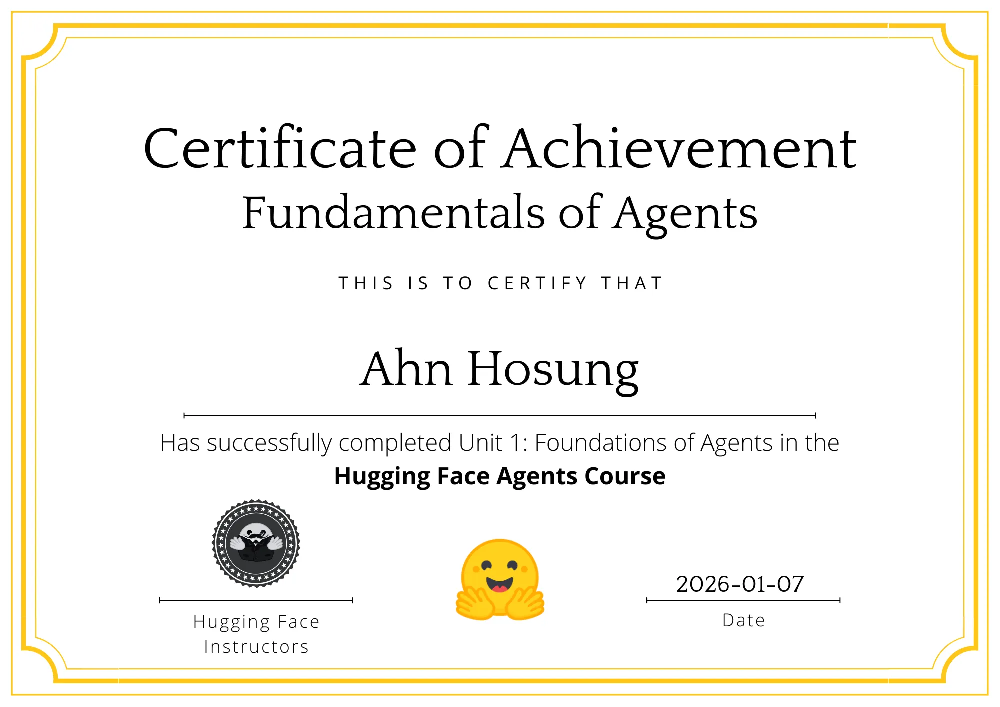
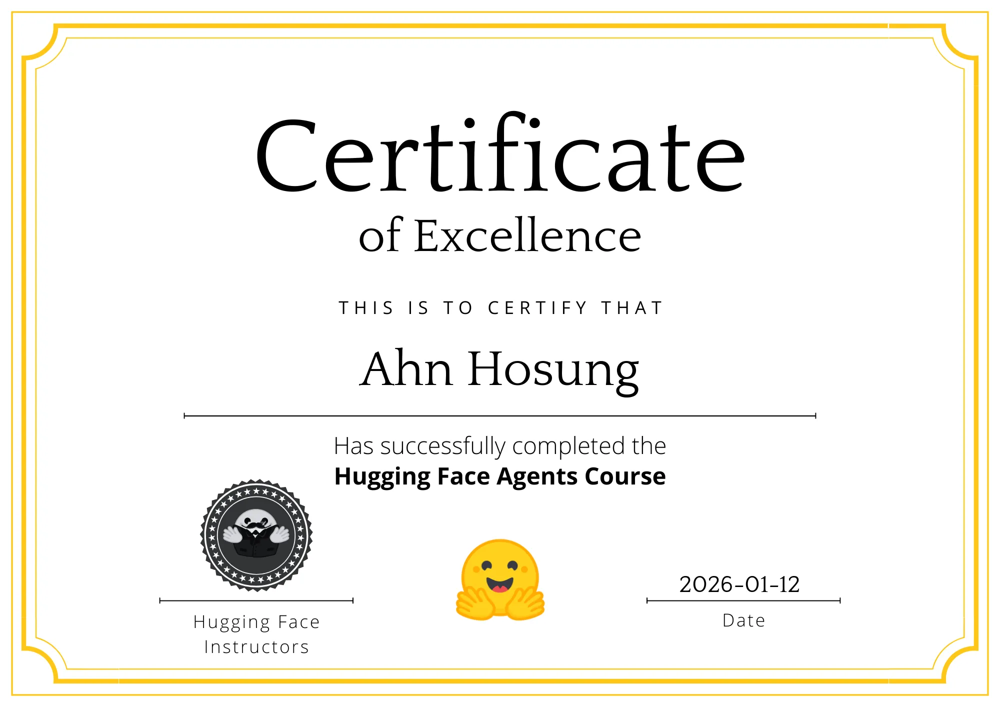

# Mission Archive

미션 수행 기록을 데이터 분석, 머신러닝/딥러닝, NLP, 오디오 AI 중심으로 정리한 문서입니다.  
각 미션은 문제 정의부터 구현, 평가, 개선 포인트까지 재현 가능하도록 구성했습니다.

## Repository Structure

- `Codeit_Mission/`: 파이썬 기초, 데이터 분석, CV/NLP/RAG 중심 미션
- `HF_Mission/`: Hugging Face Audio Course 기반 오디오 AI 미션
- `HF_Mission/certificate/`: Hugging Face 학습/수료 인증 이미지

---

## Codeit Missions

### Mission 1. 파이썬 연습 + 객체지향 기초
- 노트북: [`미션1_1팀_안호성.ipynb`](Codeit_Mission/미션1_1팀_안호성.ipynb)
- 미션 내용:
  - 기초 알고리즘(문자열/반복문/조건문) 10개 문제 풀이
  - 클래스 설계(TimeTracker, 주소록, 투표 시스템, 은행 계좌, 직원 관리, 레스토랑 예약, 도서관 관리)
  - 예외 처리와 상태 관리 중심의 실습형 문제 해결
- 구현 방식:
  - 함수 단위 문제 분해 후 입출력 케이스 기반 검증
  - OOP 모델링에서 책임 분리(도메인 객체별 메서드 분리)
  - 실제 사용 시나리오(대여/반납/투표 집계 등)로 동작 검증

### Mission 2. 호텔 예약 취소율 데이터 분석
- 노트북: [`미션2_1팀_안호성.ipynb`](Codeit_Mission/미션2_1팀_안호성.ipynb)
- 미션 내용:
  - 호텔 예약 데이터의 취소율 패턴 분석
  - `No-Show` 포함/제외 기준에 따른 취소율 비교
  - 호텔 유형/인원 규모/재방문 여부별 행동 분석
- 구현 방식:
  - 결측치 처리(`agent`, `company` 제거, `children` 보정), 통계/시각화 파이프라인 구축
  - 수치형 상관관계 히트맵 + 그룹별 취소율 집계
  - 비즈니스 해석까지 연결해 운영 전략 제안

### Mission 3. 자전거 대여 수요 예측
- 노트북: [`미션3_1팀_안호성.ipynb`](Codeit_Mission/미션3_1팀_안호성.ipynb)
- 미션 내용:
  - 시계열성 수요 데이터를 이용한 대여량 예측
  - 날씨/계절/시간대/업무일 여부가 수요에 미치는 영향 분석
- 구현 방식:
  - 이상치 제거, 스케일링, 범주형 One-Hot Encoding 적용
  - `Ridge` 중심 회귀 모델링 + `GridSearchCV`, 교차검증으로 하이퍼파라미터 탐색
  - RMSLE 관점으로 예측 모델 성능 비교 및 변수 영향 해석

### Mission 4. 포르투갈 은행 마케팅 가입 예측
- 노트북: [`미션4_1팀_안호성.ipynb`](Codeit_Mission/미션4_1팀_안호성.ipynb)
- 미션 내용:
  - 고객의 정기예금 가입 여부 분류
  - 마케팅 반응률 향상을 위한 변수 중요도 분석
- 구현 방식:
  - 모델 비교: `XGBoost`, `CatBoost`, `RandomForest`, `GradientBoosting`
  - 클래스 불균형 대응: `SMOTE` + `Optuna(TPE)` 기반 최적화
  - `Accuracy/F1/Precision/Recall` 중심으로 실무형 분류 성능 점검

### Mission 5. 오토인코더 기반 손상 이미지 복원
- 노트북: [`미션5_4팀_안호성.ipynb`](Codeit_Mission/미션5_4팀_안호성.ipynb)
- 미션 내용:
  - 문서 이미지 노이즈 제거 및 복원
- 구현 방식:
  - 이미지 리사이징/정규화 후 Denoising AutoEncoder 학습
  - 손실 및 평가를 복합 적용(`RMSE`, `PSNR`, `SSIM`)
  - 복원 전/후 시각화로 품질 개선 확인

### Mission 6. X-Ray 폐렴 분류
- 노트북: [`미션6_4팀_안호성.ipynb`](Codeit_Mission/미션6_4팀_안호성.ipynb)
- 미션 내용:
  - 흉부 X-ray 이진 분류(정상/폐렴)
- 구현 방식:
  - `ResNet18` 전이학습(후반부 층 중심 미세조정)과 `ViT` 비교 실험
  - 클래스 가중치 기반 학습으로 불균형 대응
  - 혼동행렬 + 정량지표 평가
- 주요 결과:
  - ResNet18: Accuracy 85.7, Precision 81.5, Recall 99.7, F1 89.6
  - ViT: Accuracy 85.9, Precision 81.8, Recall 99.5, F1 89.8

### Mission 7. 고양이/강아지 얼굴 영역 객체 탐지
- 노트북: [`미션7_4팀_안호성.ipynb`](Codeit_Mission/미션7_4팀_안호성.ipynb)
- 미션 내용:
  - 펫 데이터셋에서 얼굴 Bounding Box 탐지
- 구현 방식:
  - XML 어노테이션 파싱으로 탐지용 데이터셋 직접 구성
  - `SSD300_VGG16` 기반 탐지 모델 학습
  - IoU 기준 탐지 품질 모니터링
- 주요 결과:
  - Epoch 15 기준 Average Loss 0.4636, IoU 0.8455

### Mission 8. 축구 영상 Semantic Segmentation
- 노트북: [`미션8_4팀_안호성.ipynb`](Codeit_Mission/미션8_4팀_안호성.ipynb)
- 미션 내용:
  - 축구 영상 프레임에서 객체/영역 분할
- 구현 방식:
  - 마스크 정렬 및 증강 파이프라인 구축
  - `U-Net`과 `Attention U-Net` 성능 비교
  - Dice 기반 조기 종료 전략 적용
- 주요 결과:
  - U-Net 검증 Dice: 0.4894
  - Attention U-Net 검증 Dice: 0.4970

### Mission 9. 패션 아이템 조건부 생성
- 노트북: [`미션9_4팀_안호성.ipynb`](Codeit_Mission/미션9_4팀_안호성.ipynb)
- 미션 내용:
  - 라벨 조건 기반 이미지 생성
- 구현 방식:
  - `cGAN`과 조건부 `Diffusion` 모델을 동일 데이터(FashionMNIST)에 학습
  - 생성 샘플 저장 후 `FID` 기반 정량 비교
  - 학습 중 Best 체크포인트 자동 저장
- 주요 결과:
  - cGAN Best FID: 141.1829 (Epoch 23)
  - Diffusion Best FID: 55.1735 (Epoch 12)

### Mission 10. 텍스트 임베딩 + 뉴스 분류
- 노트북: [`미션10_3팀_안호성.ipynb`](Codeit_Mission/미션10_3팀_안호성.ipynb)
- 미션 내용:
  - 20 Newsgroups 데이터셋 다중 분류
- 구현 방식:
  - 토큰화 비교: `NLTK` vs `BPE`
  - 임베딩 비교: `Word2Vec`, `FastText`, `GloVe`
  - 시퀀스 분류기 비교: `LSTM`, `GRU`
  - 조합별 실험을 통해 표현 방식-모델 구조의 상호작용 분석
- 주요 인사이트:
  - 사전학습 임베딩 계열이 BPE 랜덤 초기화 대비 안정적 성능
  - BPE는 데이터/에포크 확대 시 개선 여지 확인

### Mission 11. 한영 기계번역
- 노트북: [`미션11_3팀_안호성.ipynb`](Codeit_Mission/미션11_3팀_안호성.ipynb)
- 미션 내용:
  - 일상/구어체 도메인 한-영 번역
- 구현 방식:
  - 문장 정제 후 `SentencePiece BPE` 토크나이저 학습
  - `Seq2Seq(GRU)`와 `Attention Seq2Seq(GRU)` 비교
  - Collate 함수/패딩 처리 포함한 번역 데이터로더 설계
  - `sacrebleu` 기반 BLEU 정량 평가

### Mission 12. 문서 요약 (KoBART + Qwen QLoRA)
- 노트북: [`미션12_3팀_안호성.ipynb`](Codeit_Mission/미션12_3팀_안호성.ipynb)
- 미션 내용:
  - 뉴스/사설/법률 문서 요약
- 구현 방식:
  - 데이터셋 통합 정제 후 모델별 입력 포맷 분리
  - 모델 1: `KoBART` Full Fine-Tuning
  - 모델 2: `Qwen` + `PEFT(LoRA/QLoRA)` + `SFTTrainer`
  - `ROUGE` 기반 성능 비교 및 학습 시간 대비 효율 분석
- 주요 인사이트:
  - Qwen 계열은 긴 학습 시간 대비 고성능 가능성 확인
  - KoBART는 학습 시간 대비 효율이 높은 베이스라인 제공

### Mission 13. 리뷰 감성 분석 (Full FT vs LoRA)
- 노트북: [`미션13_3팀_안호성.ipynb`](Codeit_Mission/미션13_3팀_안호성.ipynb)
- 미션 내용:
  - 쇼핑몰 리뷰 3-class 감성 분류
- 구현 방식:
  - 바이럴성 의심 문장 정규식 정제 후 학습 데이터 품질 개선
  - 백본: `klue/roberta-base`
  - 실험 비교: Full Fine-Tuning vs LoRA Fine-Tuning
  - `Accuracy`, Macro `F1` 중심으로 성능/시간 트레이드오프 분석
- 주요 결과:
  - Full FT: 정확도 0.914733, Macro F1 0.887697, 학습시간 16:48
  - LoRA FT: 정확도 0.904459, Macro F1 0.875558, 학습시간 13:30

### Mission 14. RAG 시스템 구현
- 노트북: [`미션14_3팀_안호성.ipynb`](Codeit_Mission/미션14_3팀_안호성.ipynb)
- 미션 내용:
  - 연말정산 가이드 PDF 기반 질의응답 시스템 구축
- 구현 방식:
  - 문서 로딩/청킹: `PyPDFLoader` + `RecursiveCharacterTextSplitter`
  - 하이브리드 검색: `FAISS(Dense)` + `BM25(Sparse)` + Reranker
  - 생성 모델: `yanolja/YanoljaNEXT-EEVE-Instruct-7B-v2-Preview`
  - 오케스트레이션: `LangGraph` 에이전트 + 웹 검색(`DuckDuckGoSearchRun`) 결합
  - 관측성: `Langfuse` 콜백 기반 추적

---

## Hugging Face Audio Missions

### HF Audio Mission 1. ASR 파이프라인 실습
- 노트북: [`허깅페이스 오디오 미션 1_안호성.ipynb`](HF_Mission/허깅페이스%20오디오%20미션%201_안호성.ipynb)
- 미션 내용:
  - VoxPopuli 계열 음성 데이터 기반 음성 인식 기초 실습
- 구현 방식:
  - `datasets` 스트리밍 로딩 + 오디오 스펙트럼 시각화
  - `transformers.pipeline("automatic-speech-recognition")`로 ASR 추론
  - Whisper feature extractor 기반 입력 특성 이해

### HF Audio Mission 2. 음악 장르 분류 파인튜닝
- 노트북: [`허깅페이스 오디오 미션 2_안호성.ipynb`](HF_Mission/허깅페이스%20오디오%20미션%202_안호성.ipynb)
- 미션 내용:
  - GTZAN 데이터셋 오디오 분류
- 구현 방식:
  - `distilhubert`/`WavLM` 기반 분류 모델 파인튜닝
  - `Trainer` + EarlyStopping + Accuracy 평가 자동화
  - 전처리 파이프라인(리샘플링/feature extraction/라벨 매핑) 구축
  - Hugging Face Hub 업로드 가능한 메타데이터 포맷 구성

### HF Audio Mission 3. Whisper STT 파인튜닝
- 노트북: [`허깅페이스 오디오 미션 3_안호성.ipynb`](HF_Mission/허깅페이스%20오디오%20미션%203_안호성.ipynb)
- 미션 내용:
  - `PolyAI/minds14` 데이터셋 기반 음성-텍스트 변환 모델 고도화
- 구현 방식:
  - `openai/whisper-tiny` 파인튜닝 루프 직접 구현
  - 커스텀 데이터 콜레이터와 토큰 마스킹 처리
  - `WER` 지표 기반 검증 + 추론 샘플링
  - 결과 모델 저장 및 재로드 검증

### HF Audio Mission 4. TTS
- SpeechT5에 한국어를 학습시킬려면 한국어 전용으로 커스텀할 필요가 있습니다.
- 구현 링크: [링크](https://github.com/hobi2k/SpeechT5_Korean)

---

## Hugging Face Certificates

아래 이미지는 Hugging Face 관련 학습 미션의 수료/인증 기록입니다.

